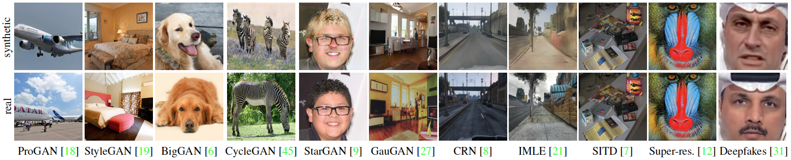
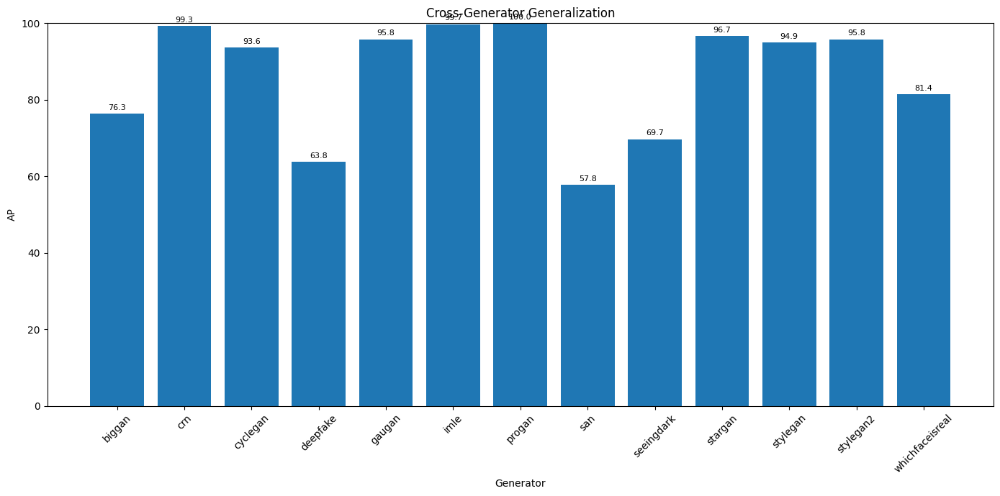

# fake-CNN-image-detection

Real vs. AI-Generated Image detector — ResNet-50 (Wang et al. 2020)  
Deployed as a Flask web app with a drag-and-drop UI.

**Live Project Report:** https://marawan-mogeb.github.io/fake-CNN-image-detection/

---

## Project Structure

```
fake-CNN-image-detection/
├── index.html              # Project report (served via GitHub Pages)
├── images/                 # Report figures
│   ├── generator_examples.png  # Synthetic vs real examples across generators
│   ├── output.png              # Training curves
│   ├── output1.png             # Grad-CAM visualizations
│   ├── output2.png             # Robustness analysis
│   ├── output4.png             # Per-class analysis
│   └── our_results.png         # Cross-generator generalization results
├── flask_app/
│   ├── app.py              # Flask server + inference logic
│   ├── requirements.txt    # Python dependencies
│   ├── Dockerfile          # Container deployment
│   ├── model/
│   │   └── resnet50.pth    # Trained checkpoint (tracked via Git LFS)
│   └── templates/
│       └── index.html      # Frontend drag-and-drop UI
└── README.md
```

> **Note:** `resnet50.pth` is tracked using [Git LFS](https://git-lfs.com). Make sure Git LFS is installed before cloning if you want the model file.

---

## What the Model Detects

The model is trained to distinguish **real photographs** from **CNN-generated (GAN) images**. Below are examples of synthetic vs. real image pairs across different generator architectures — only ProGAN was seen during training.



---

## Step 1 — Clone the Repository

```bash
# Make sure Git LFS is installed first
git lfs install

git clone https://github.com/marawan-mogeb/fake-CNN-image-detection.git
cd fake-CNN-image-detection
```

---

## Step 2 — Run Locally

```bash
cd flask_app

# Create virtual environment
python -m venv venv
source venv/bin/activate        # Windows: venv\Scripts\activate

# Install dependencies
pip install -r requirements.txt

# Start the server
python app.py
```

Open your browser at: **http://localhost:5000**

---

## Step 3 — Run with Docker

```bash
cd flask_app

# Build image
docker build -t cnn-detector .

# Run container
docker run -p 5000:5000 cnn-detector
```

Open your browser at: **http://localhost:5000**

---

## API Reference

### `POST /predict`

Upload an image and get a prediction.

**Request:** `multipart/form-data` with field `image`

**Response:**
```json
{
  "label":      "AI-Generated",
  "confidence": 97.43,
  "prob_fake":  97.43,
  "prob_real":  2.57,
  "thumbnail":  "data:image/jpeg;base64,..."
}
```

**Example with curl:**
```bash
curl -X POST http://localhost:5000/predict \
     -F "image=@/path/to/your/image.jpg"
```

**Example with Python:**
```python
import requests

with open("test.jpg", "rb") as f:
    response = requests.post(
        "http://localhost:5000/predict",
        files={"image": f}
    )
print(response.json())
```

### `GET /health`
```json
{ "status": "ok", "device": "cuda", "num_classes": 2, "model": "ResNet50-Wang2020" }
```

---

## Environment Variables

| Variable     | Default              | Description                   |
|---|---|---|
| `MODEL_PATH` | `model/resnet50.pth` | Path to the `.pth` checkpoint |

Override like this:
```bash
MODEL_PATH=/data/models/my_checkpoint.pth python app.py
```

---

## Model Details

- **Architecture:** ResNet-50, ImageNet pretrained, 2-class linear head
- **Training data:** ProGAN only (20 LSUN categories, ~120K images)
- **Augmentation:** Random Gaussian Blur (σ ~ U[0,3], p=0.5) + Random JPEG Compression (quality ~ U[30,100], p=0.5)
- **Test AP (ProGAN):** 1.0000
- **Test Accuracy:** 99.88%
- **Test AUC:** 1.0000

---

## Cross-Generator Generalization

The model was trained **only on ProGAN** data, then evaluated on 12 unseen generator architectures to test generalization. Results below are from our reproduction:



| Generator | AP (%) | Notes |
|---|---|---|
| ProGAN | ~100.0 | ✅ Trained on this |
| CRN | 99.3 | Strong generalization |
| IMLE | ~99.7 | Strong generalization |
| StarGAN | 96.7 | Strong generalization |
| GauGAN | 95.8 | Strong generalization |
| StyleGAN2 | 95.8 | Strong generalization |
| StyleGAN | 94.9 | Strong generalization |
| CycleGAN | 93.6 | Strong generalization |
| WhichFaceIsReal | 81.4 | Moderate generalization |
| BigGAN | 76.3 | Moderate generalization |
| SeeingDark | 69.7 | Weaker generalization |
| Deepfake | 63.8 | Weaker — different artifact type |
| SAN | 57.8 | Weakest — near-random |

> Weaker generalization on SAN and Deepfakes is expected: their generation pipelines differ fundamentally from ProGAN's architecture, producing different low-level statistical patterns.

---

## Notes

- The model expects **RGB images** of any size — they are resized to 256 and center-cropped to 224×224 automatically.
- GPU is used automatically if available; falls back to CPU otherwise.
- Supported formats: `jpg`, `jpeg`, `png`, `bmp`, `webp`. Maximum upload size: 10 MB.

---

## Reference

Wang, S. Y., Wang, O., Zhang, R., Owens, A., & Efros, A. A. (2020).  
**CNN-Generated Images Are Surprisingly Easy to Spot… For Now.**  
*CVPR 2020.* arXiv: `1912.11035`

---

CSE 429 · Computer Vision · E-JUST Spring 2026